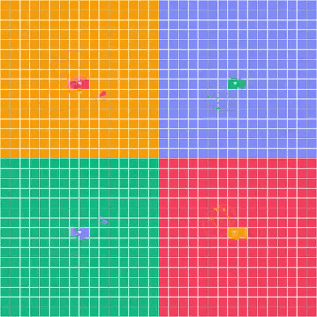

# 🎹 Lo-Fi Pong Wars (Generative Soundscape & Territory Simulation)

> An autonomous zero-player ambient simulation blending **Generative Lo-Fi Synthesis**, **Dynamic Jazz Chord Progressions**, and **Multi-Faction Territory Battles** for focus, study, and relaxation.

<p align="center">
  <a href="https://yujunwang.github.io/lofi-pong-wars/">
    
  </a>
</p>

<p align="center">
  
</p>

<p align="center">
  <em>🎮 Procedural simulation: 4 elemental factions battling for territory while synthesizing dynamic chord progressions in real-time.</em>
</p>

<p align="center">
  <a href="LICENSE"></a>
  <a href="index.html"></a>
  <a href="index.html"></a>
  <a href="https://gsap.com"></a>
  <a href="index.html"></a>
</p>

🔗 **Online Experience**: [https://yujunwang.github.io/lofi-pong-wars/](https://yujunwang.github.io/lofi-pong-wars/)

---

## ✨ Key Features

1. **4 Curated Soundscape Styles with Polyphonic Voice Roles**
   - **☕ Lo-Fi Study**: Warm Rhodes (Tenor) + Upright Sub Bass + Music Box (Treble) + Muted Acoustic Pluck.
   - **🌌 Cyber Synth**: 80s Analog Saw Lead + Reese Sub Bass + FM Crystal Arp + Neon Pluck.
   - **🎋 Zen Garden**: Plucked Koto (古箏) + Bamboo Flute Drone (尺八) + Singing Bowl + Kalimba.
   - **👾 8-Bit Arcade**: NES Square Lead (50% Pulse) + Triangle Bass + Pulse Arp + Retro Coin Blip.
   - Instant style switching via the floating Studio Deck or keyboard shortcut `S`.

2. **16 Subtle Wall Percussion Voices (Boundary Acoustics)**
   - Micro-percussive textures ($0.02 \sim 0.08\text{s}$) when bouncing against outer borders (wood rimshots, sub thumps, glass tings, bamboo clacks, and waterdrop plops).
   - Real-time stereo panning and anti-rattle frequency throttling.

3. **Multi-Faction Warfare (2, 3, or 4 Balls)**
   - **2 Balls**: Amber Sunset (`#f59e0b`) vs. Twilight Lavender (`#818cf8`).
   - **3 Balls**: Amber vs. Lavender vs. Emerald Sage (`#10b981`).
   - **4 Balls**: 4-Quadrant battle adding Coral Rose (`#f43f5e`).
   - Switch via UI buttons or keys `2`, `3`, `4`.

4. **Mobile Ergonomic Floating Dock & Studio Drawer**
   - Responsive floating bottom dock with safe-area support for iOS & Android.
   - Collapsible slide-up studio drawer for speed, volume, and focus timer controls.
   - Smooth touch-drag ripples to physically interact with bouncing balls.

5. **Background Tab Web Worker Audio Engine**
   - Decoupled 60Hz Web Worker ticker ensures **music and physics keep running uninterrupted even when switching tabs**.
   - Zero external audio files—everything synthesized mathematically in real-time.

6. **Productivity & Focus Companion**
   - Built-in **Timestamp-Accurate Pomodoro Focus Timer** (25m / 50m / 5m presets) with gentle completion chime.
   - Vinyl warmth crackle generator and master volume control.
   - `Space` key to pause/resume anytime.

---

## 🚀 Quick Start

### 1. Run Locally
Simply open `index.html` in your favorite web browser:
```bash
# Windows
start index.html

# macOS
open index.html

# Linux
xdg-open index.html
```

### 2. Deploy to GitHub Pages
1. Fork or push this repository to your GitHub account.
2. Navigate to **Settings** -> **Pages**.
3. Under **Branch**, select `main` and directory `/ (root)`.
4. Click **Save**—your generative ambient toy is live!

---

## ⌨️ Keyboard Shortcuts

| Key | Action |
|---|---|
| `Space` | Toggle Play / Pause simulation |
| `S` | Cycle through 4 Sound Styles |
| `2` | Switch to 2-Ball Duel Mode |
| `3` | Switch to 3-Ball Triad Mode |
| `4` | Switch to 4-Ball Quadrant Mode |

---

## 💡 Acknowledgements & Inspiration

- Concept inspired by [vnglst/pong-wars](https://github.com/vnglst/pong-wars).
- Built with [GSAP](https://gsap.com) and the Web Audio API.

---

## 📄 License

This project is licensed under the [MIT License](LICENSE).
