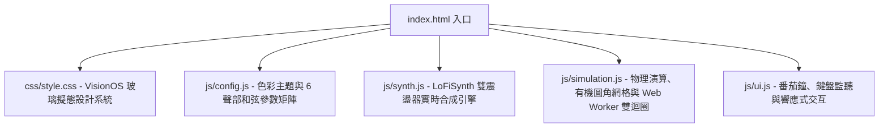

# Lo-Fi Pong Wars (生成式音樂領地爭奪模擬)

## 📊 同步狀態 (Sync Status)
> [!info] 
> **GitHub Repo**: [YuJunWang/lofi-pong-wars](https://github.com/YuJunWang/lofi-pong-wars)  
> **線上體驗 (GitHub Pages)**: [yujunwang.github.io/lofi-pong-wars/](https://yujunwang.github.io/lofi-pong-wars/)  
> **當前完成版本**: `v2.0.3` (Commit `8df8ea7`)  
> **作者節點**: [[Yu-Jun Wang]]

---

## 🎯 專案緣起與核心願景 (Origin & Vision)

本專案靈感源自開源社群 Koen van Gilst 所作的經典《Pong Wars》（晝夜兩球領地爭奪）。然而，原始版本的方塊邊界過於生硬，且缺乏音訊維度，僅能作為單純的視覺展示。

我們設定的核心願景是：**將單純的像素碰撞模擬，升級為具備多感官沉浸體驗的「生成式環境音樂與專注陪伴工具」**。
1. **有機生命力 (Organic Aesthetic)**：打破傳統網格生硬的階梯狀鋸齒，引入液態圓角演算法（Filleted Seams），讓領地如同黏菌或水墨擴散般有機融合。
2. **純演算法即時合成 (Zero-Sample Web Audio)**：不使用任何預錄音檔（No MP3/WAV），純粹透過瀏覽器底層 Web Audio API 建立和弦震盪器、低通濾波器與包絡線，生成溫潤的 Lo-Fi 爵士和弦。
3. **無建置依賴 (Zero-Build Vanilla Stack)**：摒棄龐大的 Node/Webpack/Vite 建置鏈，堅持 100% 純原生 HTML5 + ES6 + CSS3，本機雙擊 `index.html` 即可零延遲啟動。
4. **多陣營動態爭霸 (2P ~ 6P Scalability)**：從經典雙方對決，無縫擴展至 3、4、5、6 方多邊形割據混戰，且各自配置專屬的聲部編制與音色矩陣。

---

## 🏗️ 系統架構與技術棧盤點 (Architecture & Tech Stack)

專案採用嚴謹的模組化分層架構，所有模組均在全域環境下保持職責單一與高內聚：

### 關鍵技術選型
* **渲染層**：HTML5 Canvas 2D Context + 整數像素對齊（Integer-Pixel Snapping），消除次像素模糊。
* **動畫與微交互**：GSAP (GreenSock) 3.12 驅動的頂部領地膠囊計數與 HUD 即時平滑過渡。
* **背景運算解耦**：Inline Web Worker（透過 Blob URL 建立）獨立維持 60FPS 物理時脈，突破瀏覽器分頁閒置時 `requestAnimationFrame` 被系統強制節流至 1FPS 的限制。
* **介面語彙**：現代 VisionOS / iOS 浮動膠囊（Floating Glass Pill Dock）與毛玻璃 Popover 控制台。

---

## 🧭 核心模組深度解析 (Deep Dive)

### 1. 有機領地繪製與邊界圓角算法 (Organic Filleted Meshing)
傳統方塊網格在放大時邊緣極度銳利。我們實作了一套自適應鄰域判定算法：
* **四鄰同陣營掃描**：對每個格子檢測其上、下、左、右鄰居是否屬於同一隊伍。
* **外凸圓角 (Convex Fillets)**：若格子外側為敵方領地，透過 `ctx.roundRect` 對孤立角落施加半徑為 `R = tileSize * 0.35` 的圓角。
* **內凹橋接 (Concave Fillets)**：當兩相鄰格子為同隊、但其對角線格子為敵隊時，在交界處繪製弧形切角補丁（`arcTo`），填補直角凹陷，讓相鄰方塊融合成圓潤平滑的有機生物群島。
* **1px 縫隙消除 (Seam Bleed)**：僅在相鄰同隊格子之間主動延伸 1px 重疊，消除高解析度螢幕下的次像素白邊。

### 2. 實時和弦語義與 6 聲部合成矩陣 (Web Audio Polyphonic Engine)
* **和弦自動進行**：每累積翻轉 24 格（`CHORD_CHANGE_HITS`），全域和弦自動切換至下一級（如 `Ebmaj9` ➔ `Cm7` ➔ `Fm9` ➔ `Bb13`）。
* **縱座標音高映射**：將畫布 Y 軸座標反向映射至當前和弦的調內音階，高處碰撞產生清脆高音、低處碰撞觸發溫暖低音。
* **橫座標立體聲聲相**：將 X 軸碰撞點映射至 `StereoPannerNode`（-0.8 到 +0.8），戴耳機時能清晰感知球體從左彈到右的空間移動。
* **動態黑膠底噪**：內建白噪聲生成器，經過二階帶通濾波器（Bandpass）與低頻顫音（LFO），模擬老唱片的溫暖破音與塵埃感（Vinyl Crackle）。

### 3. 多陣營扇形分割與質心生成 (Multi-Faction Radial Geometry)
在 3P 至 6P 模式下，畫布以幾何中心進行放射狀角平分割。球體的初始誕生點則精準落在各扇形區域的「面積質心（Centroid）」上，並賦予指向幾何外圍的初速度向量，確保開局時所有球體向外擴張，徹底杜絕剛開局就在中心點互撞的死局。

---

## ⚡ 關鍵踩坑、架構重構與迭代紀錄 (Engineering Pitfalls & Resolutions)

在整個開發過程中，我們面臨並逐一解決了多個高難度的架構問題：

### 🚨 坑點一：行動端佈局崩塌（Popover 幽靈高度頂起 Dock）
* **現象**：在手機豎屏（寬度 360~390px）查看時，底部的控制列（Dock）竟然漂浮在畫布正中央，且右側 Studio 按鈕被螢幕邊界切斷。
* **根因定位**：
  1. 手機版樣式原先為了讓抽屜面板置於 Dock 上方，設定了 `flex-direction: column-reverse`。
  2. 但 `.studio-popover` 雖然在關閉時設定了 `opacity: 0`，**卻仍停留在 Flex 文檔流中，佔據了整整 474px 的垂直空間**！
  3. 這 474px 的「隱形幽靈高度」把 Dock 往上硬生生頂了將近 500 像素，正好停在畫布的正中間！
* **解法**：
  1. 將 `.studio-popover` 徹底**脫離文檔流，改為絕對定位**（`position: absolute; bottom: calc(100% + 10px); left: 50%`）。在關閉時佔用高度為 `0px`，Dock 順利回歸手機最底端。
  2. 下拉選單文字精簡為純標籤（`Lo-Fi`、`Cyber`、`Mono`），將總寬度壓縮至 280px，並加上 `overflow-x: auto`，在所有窄螢幕裝置上達成 100% 居中且零溢出。

### 🚨 坑點二：5/6 球多發混戰的「高頻尖銳與聽覺轟炸」
* **現象**：使用者反饋在切換到 5 球或 6 球模式時，音效非常尖銳刺耳，令人煩躁。
* **根因定位**：
  1. **聲部倍頻失控**：第 4 號球在 `Zen Garden` 模式下的風鈴設定了 `mult: 2.5`、濾波器高達 4200Hz，碰撞時直接飆破 1.2kHz，產生持續性的耳鳴金屬蜂鳴；在 `8-Bit` 模式下則是 5500Hz 的高頻方波（Square Wave），諧波撕裂感極強。
  2. **邊界翻轉雙重觸發**：邊界碰撞檢測誤將「最外圈格子翻轉」也當作撞牆，導致 5~6 顆球在邊緣頻繁換色時，**每次碰撞都同時發出「鋼琴音符」+「高頻撞擊打擊樂」**，造成高頻暫態在毫秒內劇烈疊加。
* **解法 (v2.0.2)**：
  1. 將所有高頻聲部倍頻統一收束至 `1.0x`，正弦波與三角波低通濾波器壓制在 1200Hz~1800Hz，將尖銳風鈴重塑為古寺溫潤陶鐘（Clay Chime），將撕裂方波重塑為復古三角波。
  2. 移除格子翻轉的額外打擊樂，將 Percussion 回歸實體撞擊畫布邊界框時才發聲，背景音立刻回復平靜通透。

### 🚨 坑點三：背景分頁記憶體洩漏（InkBlooms 堆積）
* **現象**：當使用者切換到其他分頁長期運作後切回，瀏覽器會出現明顯卡頓。
* **根因定位**：背景分頁時 Web Worker 正常運作持續呼叫 `updatePhysics()` 產生墨水擴散特效（`inkBlooms`），但負責繪製並清除生命的 `draw()` 卻因 `requestAnimationFrame` 被瀏覽器凍結而未執行，造成陣列物件在記憶體中無限暴增。
* **解法**：在 `updatePhysics()` 內部引入生命週期主動修剪機制（Active Lifespan Pruning），並對 `inkBlooms` 設定 40 個物件的上限水位線，超出即強制釋放。

### 🚨 坑點四：視窗縮放導致即時戰局強制重置
* **現象**：使用者旋轉手機螢幕或調整視窗大小時，原本激烈搏殺到一半的領地版圖會瞬間被清空重置為原始方格。
* **根因定位**：`resizeCanvas()` 原先直接無腦呼叫 `setupGridAndBalls()`。
* **解法**：重構縮放邏輯，保留既有的 `grid` 二維陣列狀態，僅對所有進行中的球體座標依照新舊尺寸比例（`scaleRatio = newSize / oldSize`）進行線性插值等比縮放，達成流暢無縫的動態響應。

### 🚨 坑點五：黑白極簡水墨調色盤（Monochrome Minimal）設計 (v2.0.3)
* **決策**：將飽和度偏低、視覺效果較不明顯的 `Warm Mocha` 退役，替換為包浩斯極簡風的 `Monochrome Minimal`。
* **明度階梯演算**：為解決黑白風格在多球對抗時容易難以分辨的問題，精確設計了 6 階明度（Luminance）：
  * Team 0: `#ffffff` (100% 宣紙白)
  * Team 1: `#18181b` (10% 曜石黑)
  * Team 2: `#71717a` (45% 中度冷灰)
  * Team 3: `#d4d4d8` (83% 亮鉑銀灰)
  * Team 4: `#3f3f46` (25% 深炭黑灰)
  * Team 5: `#a1a1aa` (65% 輕石板灰)
  在 2P 模式下呈現純粹的 10:1 太極黑白，在 6P 模式下亦能清晰辨識領地割據。

### 🚨 坑點六：行動端瀏覽器強快取死結 (Cache Busting)
* **現象**：代碼推送到 GitHub Pages 後，手機瀏覽器即使點選重新整理，畫面依舊呈現舊版跑版狀態。
* **根因**：行動裝置 Chrome/Safari 對於無查詢參數的 `.css` 與 `.js` 檔會強制讀取本機 Disk Cache，甚至忽略 304 協商。
* **解法**：全面為引用路徑加上版本雜湊參數（如 `css/style.css?v=2.0.3`），並撰寫自動化輪詢腳本驗證 GitHub CDN 部署狀態，確保全終端使用者即時取得最新版本。

---

## 🛠️ 流程中調用的 Antigravity 專業技能 (Skills Leveraged)

在整個專案的孵化與打磨過程中，我們高度活用了全域的多項專業技能：

1. **`humanizing-ai-text` (去 AI 感與本地化文案)**：
   * 用於精煉專案的 `README.md`，拔除冗長廢話、空洞清單與 AI 常用套話，實施 Level 3~4 的精簡瘦身（從 112 行壓縮至 66 行）。
   * 遵循臺灣繁體中文慣用語法，建立了完全平行的繁體中文文檔 `README.zh-TW.md`。
2. **`systematic-debugging` (系統性排查與根本原因除錯)**：
   * 面對手機版介面懸空、音訊高頻刺耳、背景執行緒記憶體增長等複合性問題，遵循「不猜測、先度量、抓根本、做最小改動」原則。
   * 透過 Playwright 無頭瀏覽器實時提取 DOM 邊界矩形（BoundingRects）與 Web Audio 震盪器創建指標，用數據確診問題。
3. **`frontend-design` & `ui-ux-pro-max` (介面美學與動態體驗)**：
   * 打造具備 28px 高斯模糊的毛玻璃懸浮膠囊（Fluid Glass Segmented Controls）。
   * 指導安全邊距（Safe Area Insets: `--sat`, `--sab`）的實裝，確保全面適配 iPhone 瀏海與動態島。
4. **`global-wiki-query` (全域知識沉澱規範)**：
   * 嚴格遵守跨專案資料隔離原則，不在目標專案直寫圖書館，而是在本機產生標準規格的知識草稿，確保全域圖書館的安全與乾淨。

---

## 🚀 成果發布與社群推廣規劃 (Distribution & Milestones)

### 1. Threads 影音宣傳最佳規格
* **影片長度**：建議 **30 ~ 45 秒**。
* **錄製節奏**：避免從開局的單調半圓開始錄製；建議在四方或六方大混戰進行到 30 秒、領地呈現鋸齒與膠著咬合的高潮轉折點開始錄製，視覺與聽覺吸睛度最高。
* **推薦推文標籤 (Hashtags)**：
  `#creativecoding` `#webdevelopment` `#generativeart` `#lofi` `#frontend` `#indiedev` `#javascript`

### 2. GitHub 開源成就里程碑
* 完成第一次標準分支管理與 PR 合併流水線（PR #1: `feat/organic-territory` ➔ `main`）。
* 正式觸發並解鎖 GitHub 官方 **Pull Shark 鯊魚成就勳章 🦈**。

---

## 🔗 知識庫來源關聯 (Sources & Backlinks)
* 專案作者節點：[[Yu-Jun Wang]]
* 相關技術概念：[[Web Audio API]], [[Canvas 2D Context]], [[Generative Art]], [[Creative Coding]], [[Design Systems]]
* 架構哲學：[[Agentic Engineering]], [[Systematic Debugging]]
